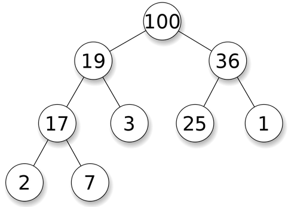

## Heaps Exercises

In pairs, complete the following exercises.

Save your work in your repo: ```classwork/xx_heaps/exercise/YOUR_FILES_HERE```

Save your answers in a txt, md, doc or pdf file (example: answers.txt)

Upload the pictures of your heap.

### Exercise 1: Adding to a heap:

Consider this heap:




Try to find a solution to:

1. Add the value 200 to that heap. Draw a tree(s) showing how this operation would work (upload pic to your repo). In a few words describe how it works.
2. Add the value 20 to the new heap. Draw a tree(s) showing how this operation would work (upload pic to your repo). In a few words describe how it works.
3. What is the runtime of this algorithm? Explain.

**HINT:** If you add a new node it should be added as the left child of the 3. And depending on the value of the element it may not go there.

### Exercise 2: Removing from a heap:

Consider the heap from the previous exercise, and respond the following questions:

1. How would you remove the 200? 
2. What position ultimately must have no value?
3. What would a valid heap look like afterwards? Draw it and upload it to your repo.
4. How would you then remove the next largest element?
5. What is the runtime of this algorithm?

**HINT:** Replace the root node with the lowest, right-most item on the heap.

